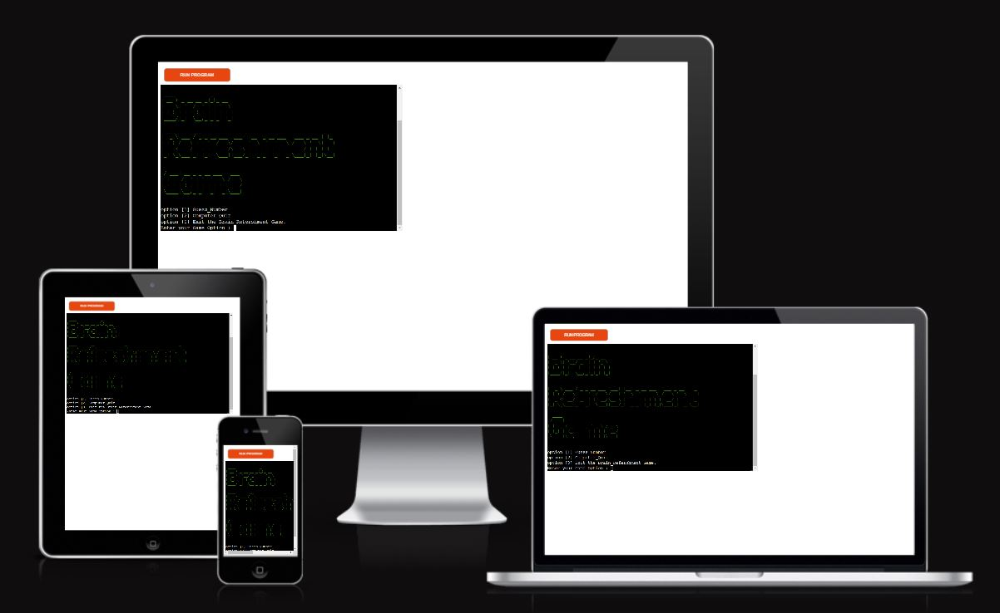
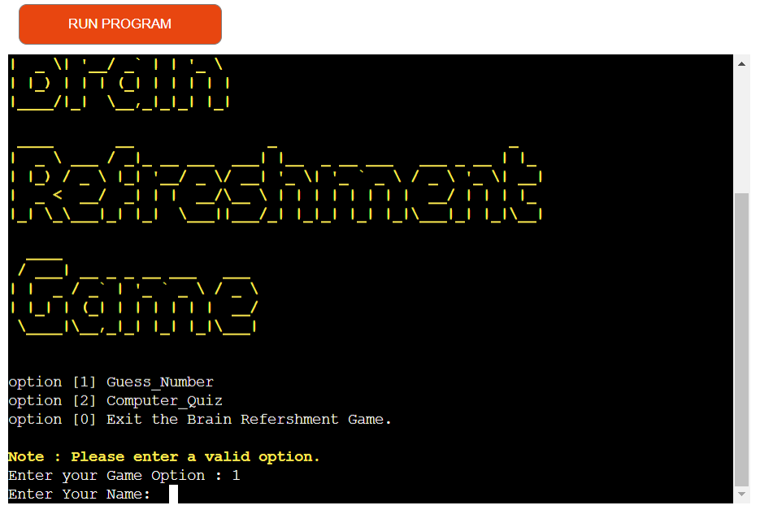

# Brain Refreshment Game
Brain refreshment Game is a Python terminal game which runs on Heroku.

Brain refreshment Game includes two games, first is number guessing game and second is Computer Quiz.
## Game 1: Number Guessing Game
Description: Most of the persons from a CS (Computer Science) background, think of their very first project after doing a Programming Language a simple number guessing game. The user attempts to guess a number between 1-50, if they guess too low they are told to guess 
higher, if they guess too high they are told to guess lower, and the game continues until they guess the correct number.
## Game 2: Computer Quiz
Description: A computer quiz game in Python. The user attempts to write correct answer of quiz which are related to cpython some short cuts which we are using in day today life, if they write correct answer then at the end they will win the game. if they write some correct answer and some incoorect answer then they will have result with percentage.

[Link to the Brain Refreshment game](https://brain-refreshment-game.herokuapp.com/)

* [How to play](#How-to-play)
* [User Experience (UX)](#User-Experience-(UX))
  * [Key Information](#key-information)
  * [User Stories](#User-Stories)

* [Technologies Used](#Technologies-Used)
  * [Languages Used](#Languages-Used)
  * [Frameworks, Libraries & Programs Used](#Frameworks,-Libraries-&-Programs-Used)

* [Testing](#Testing)
  * [Solved Bugs](#Solved-Bugs)
  * [Known Bugs](#Known-Bugs)
  * [PEP8](#pep8)
  * [Manual Testing](#Manual-Testing)

* [Deployment](#Deployment)
  * [Local Deployment](#Local-Deployment)
  * [Remote Deployment](#Remote-Deployment)
  * [Deploy project to Heroku](#Deploy-project-to-Heroku)
  
* [Credits](#Credits)
  * [Code](#Code)
  * [Content](#Content)
  * [Acknowledgements](#Acknowledgements)

## How to play

The object of the game is to refreshment of Brain. Hence both game are very simple and made up of purpose with mind diversion. 

#### Number Guessing Game :
If the User inputs range, let’s say from 1 to 100. And compiler randomly selected 42 as the integer. And now the guessing game started, so the user entered 50 as his/her first guess. The compiler shows “Try Again! You guessed too high”. That’s mean the random number (i.e., 42) doesn’t fall in the range from 50 to 100. That’s the importance of guessing half of the range. And again, the user guesses half of 50 (Could you tell me why?). So the half of 50 is 25. The user enters 25 as his/her second guess. This time compiler will show, “Try Again! You guessed too small”. That’s mean the integers less than 25 (from 1 to 25) are useless to be guessed. Now the range for user guessing is shorter, i.e., from 25 to 50. Intelligently! The user guessed half of this range, so that, user guessed 37 as his/her third guess.  This time again the compiler shows the output, “Try Again! You guessed too small”. For the user, the guessing range is getting smaller by each guess. Now, the guessing range for user is from 37 to 50, for which the user guessed 43 as his/her fourth guess. This time the compiler will show an output “Try Again! You guessed too high”. So, the new guessing range for users will be from 37 to 43, again for which the user guessed the half of this range, that is, 40 as his/her fifth guess.  This time the compiler shows the output, “Try Again! You guessed too small”. Leaving the guess even smaller such that from 41 to 43. And now the user guessed 41 as his/her sixth guess. Which is wrong and shows output “Try Again! You guessed too small”. And finally, the User Guessed the right number which is 42 as his/her seventh guess.

Total Number of Guesses = 7

#### Computer Quiz :
The Quiz game asks the player questions related to Computer, just general quetion. They have a chances to answer each question you don't want to take the quiz too difficult. Each correct answer will score a point. At the end of the game, the program will reveal the player's final score.

### Key information:
* User must enter a name to play
* Win or lose the user is given an option to play again.

### User Stories

#### Client Goals
* To entertain users & refreshment of brain. Its like small break.
* To be able to learn how to play
* To make it easy for users to interact with the game
* To be clearly informed of invalid input and how to proceed
* Win or lose, to play the game to completion without issue
* To be able to choose to play again or quit

#### First Time Visitor Goals
* I want to enter my name.
* I want to be able to learn how to play.
* I want to be given instant feedback if a correct or incorrect guess is made.
* I want to be able to guess the number or correct answer if I think I know what it is.
* I want to be informed when the game is over, if I've won or lost.
* I want to be able to play again or quit.

#### Returning Visitor Goals
* I want to be able to play the game multiple times with a new word.

## Features
Below are the main features the user will come across when playing the game. The terminal is cleared each time to make it clean and prevent confusion if the user starts to scroll.

1. Brain Refreshment game is displayed, with a short message and a request for the user input their game option. The game option entered by the user is then used by the computer. Also Short note is provided in yellow color so that user can insert only valid number which is shown on screen.

 Once user input is validated so that a game option (1, 2 or 0) is only accepted if there is number. Next short message will be displayed and a request for the user input their name option

After entering game opting, User input is validated to enter name.(docs/first_feature_1.PNG)

2. The user is called by their name and welcomed to the game. Two menu options are provided, to either play the game or no. This menu driven interactivity has a clear message requesting input from the user on how they want to proceed. User input is validated so that either "yes" or "no" is accepted. 

## Technologies Used

### Languages Used
Python

### Frameworks, Libraries & Programs Used
* [Am I responsive?](https://ui.dev/amiresponsive) - to show game across a range of devices.
* Git - for version control. 
* GitHub - to save and store the code pushed from Git.
* GitPod - using GitPod terminal to commit to Git and push to GitHub.

## Testing 
Issues raised in my project meetings with my mentor Brian Macharia.

It was suggested that to improve computer Quiz coding, the user should be able to know the correct asnwer if they wrote incorrect answer.

### Solved Bugs

1. I made two games with python in seperate repositories. My mentor suggested me to combine both game in one game and provide options to user which game he has to play. I again wrote code to cmbine two games and learned, solved bugs and made it fix with one signle game with two options.

2. Correct answer were not displaying to**********************

### Known Bugs

1. If user eters incorrect answer in computer quiz game then it is showing only incorrect answer. I was thinking to add correct answer but due to time constraint i could not come with correct code for the same.

### PEP8 

### Manual Testing

## Deployment 

### Local Deployment

#### How to Clone
1. Sign up or log in to GitHub
2. Go to the repository 
3. Go to the code dropdown and select how you'd like clone and copy the link provided
4. Go to the new repo and enter in your workspace terminal, "git clone" (without quotes) followed by the link copied
5. Install termcolor by entering "pip3 install termcolor" (without quotes) to the terminal 
6. Enter the following command "pip3 freeze > requirements.txt" (without quotes) to the terminal to install the termcolor dependency which will be required if this is deployed to Heroku
7. Enter command "python3 run.py" (without quotes) to run the game in the terminal

#### How to Fork
1. Sign up or log in to GitHub
2. Go to the repository 
3. Click on the fork button towards the top right of the page 

### Remote Deployment
The website was deployed to GitHub Pages as follows:
1. Log in to GitHub
2. Assuming you have cloned or forked the repository, go on the "Settings" link for this repository
3. Click on the "Pages" link on the left hand side of the page
4. Under "Source" select "Deploy from branch" from the dropdown
5. Under "Branch" select "main" from the dropdown
6. Click "Save" which will then refresh the page
7. It might take a few mins before you can refresh and view the link to the site published

### Deploy project to Heroku
1. Assuming you have cloned or forked the repository, sign up or log in to Heroku
2. Go to "new" and click "create new app", the "create new app" is also available from the dashboard
3. Enter a unique app name and choose a region
4. Click "create app"
6. Go to the Settings tab and set the Buildbacks to Python and NodeJS, in that order
7. On the same tab go to Config Vars, click "reveal config vars" and enter PORT in to "KEY" and 8000 in to "VALUE" and then click "Add"
8. Now go to the Deploy tab and click "Connect to Github" from Deployment Method.
9. Search by the repository name (which needs to match exactly), once this is found 
10. Enable automatic deploys if preferred 
11. Go to Manual deploy, the branch to deploy should be main and then click on "Deploy Branch"
12. Once deployment is complete you can click "View" to open the game in Heroku

- - -

## Credits

### Code

### Content

### Acknowledgements 
Thank you to anyone taking the time to view my third project. Special thanks to the Slack community and the below individuals:
* 
