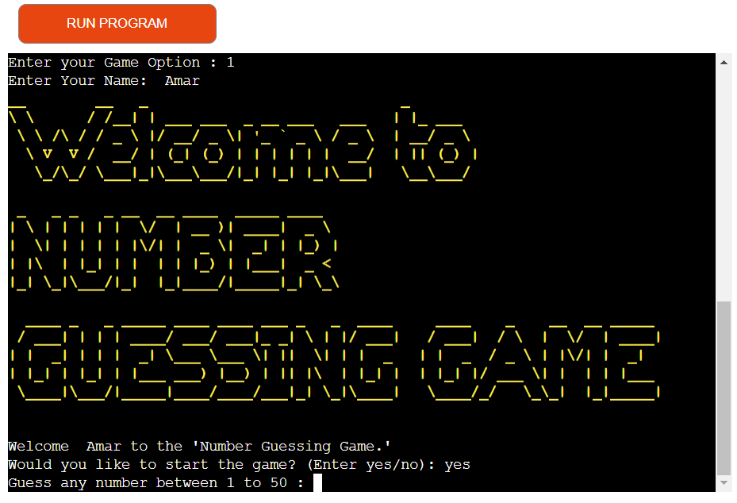
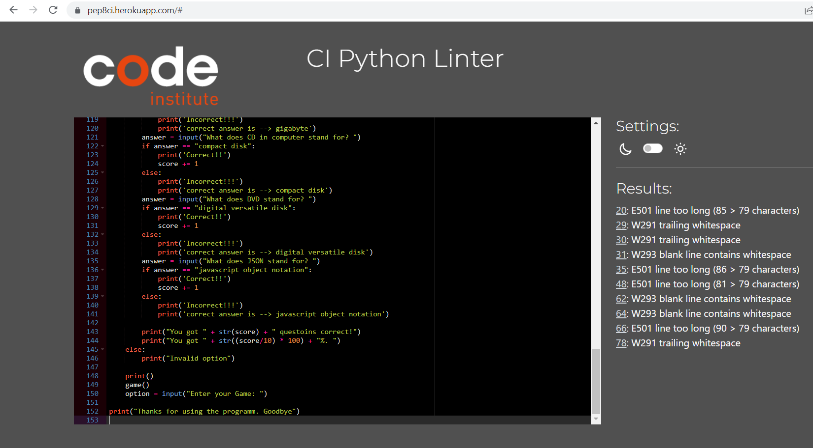

# Brain Refreshment Game
Developer : Amar Dange

Brain refreshment Game is a Python terminal game which runs on Heroku.
Brain refreshment Game includes two games, first is number guessing game and second is Computer Quiz.

## Game 1: Number Guessing Game
Description: Most of the persons from a CS (Computer Science) background, think of their very first project after doing a Programming Language a simple number guessing game. The user attempts to guess a number between 1-50, if they guess too low they are told to guess 
higher, if they guess too high they are told to guess lower, and the game continues until they guess the correct number.
## Game 2: Computer Quiz
Description: A computer quiz game in Python. The user attempts to write correct answer of quiz which are related to cpython some short cuts which we are using in day today life, if they write correct answer then at the end they will win the game. if they write some correct answer and some incoorect answer then they will have result with percentage.

[Link to the Brain Refreshment game](https://brain-refreshment-game.herokuapp.com/)

* [How to play](#How-to-play)
* [User Experience (UX)](#User-Experience-(UX))
  * [Key Information](#key-information)
  * [User Goals](#User-Goals)
  
* [Design](#Design)
  * [Colour Scheme](#Colour-Scheme)
  * [Flowchart](#Flowchart)

* [Technologies Used](#Technologies-Used)
  * [Languages Used](#Languages-Used)
  * [Frameworks, Libraries & Programs Used](#Frameworks,-Libraries-&-Programs-Used)
  * [Third Party Libraries](#third_party_libraries)

* [Testing](#Testing)
  * [Solved Bugs](#Solved-Bugs)
  * [Unsolved Bugs](#Unsolved-Bugs)
  * [PEP8](#pep8)
  * [Manual Testing](#Manual-Testing)

* [Deployment](#Deployment)
  * [Heroku](#LHeroku)
  * [Clone a Github Repository](#Clone_a_Github_Repository)
  
* [Credits](#Credits)
  * [Code](#Code)
  * [Content](#Content)
  * [Acknowledgements](#Acknowledgements)

## How to play

The object of the game is to refreshment of Brain. Hence both game are very simple and made up of purpose with mind diversion. 

#### Number Guessing Game :
If the User inputs range, let’s say from 1 to 100. And compiler randomly selected 42 as the integer. And now the guessing game started, so the user entered 50 as his/her first guess. The compiler shows “Try Again! You guessed too high”. That’s mean the random number (i.e., 42) doesn’t fall in the range from 50 to 100. That’s the importance of guessing half of the range. And again, the user guesses half of 50 (Could you tell me why?). So the half of 50 is 25. The user enters 25 as his/her second guess. This time compiler will show, “Try Again! You guessed too small”. That’s mean the integers less than 25 (from 1 to 25) are useless to be guessed. Now the range for user guessing is shorter, i.e., from 25 to 50. Intelligently! The user guessed half of this range, so that, user guessed 37 as his/her third guess.  This time again the compiler shows the output, “Try Again! You guessed too small”. For the user, the guessing range is getting smaller by each guess. Now, the guessing range for user is from 37 to 50, for which the user guessed 43 as his/her fourth guess. This time the compiler will show an output “Try Again! You guessed too high”. So, the new guessing range for users will be from 37 to 43, again for which the user guessed the half of this range, that is, 40 as his/her fifth guess.  This time the compiler shows the output, “Try Again! You guessed too small”. Leaving the guess even smaller such that from 41 to 43. And now the user guessed 41 as his/her sixth guess. Which is wrong and shows output “Try Again! You guessed too small”. And finally, the User Guessed the right number which is 42 as his/her seventh guess.

Total Number of Guesses = 7

#### Computer Quiz :
The Quiz game asks the player questions related to Computer, just general quetion. They have a chances to answer each question you don't want to take the quiz too difficult. Each correct answer will score a point. At the end of the game, the program will reveal the player's final score.

### Key information:
* User must enter a name to play
* Win or lose the user is given an option to play again.

### User Goals

#### Client Goals
* To entertain users & refreshment of brain. Its like small break.
* To be able to learn how to play
* To make it easy for users to interact with the game
* To be clearly informed of invalid input and how to proceed
* Win or lose, to play the game to completion without issue
* To be able to choose to play again or quit

#### First Time Visitor Goals
* I want to enter my name.
* I want to be able to learn how to play.
* I want to be given instant feedback if a correct or incorrect guess is made.
* I want to be able to guess the number or correct answer if I think I know what it is.
* I want to be informed when the game is over, if I've won or lost.
* I want to be able to play again or quit.

#### Returning Visitor Goals
* I want to be able to play the game multiple times with a new word.

## Design

### Colour Scheme
The termcolor module was used to print colored text.

Bright and bold colors were used throughout the game to draw the users attention for a specific purpose or engagement.

### Flowchart
Below is the initial design put together using [Lucid Chart](https://lucid.app/) to plan the logic of the game.

Flowchart

## Features
Below are the main features the user will come across when playing the game. The terminal is cleared each time to make it clean and prevent confusion if the user starts to scroll.

1. Brain Refreshment game is displayed, with a short message and a request for the user input their game option. The game option entered by the user is then used by the computer. Also Short note is provided in yellow color so that user can insert only valid number which is shown on screen.

To select game option

 Once user input is validated so that a game option (1, 2 or 0) is only accepted if there is number. Next short message will be displayed and a request for the user input their name option

User Name

2. The user is called by their name and welcomed to the game. Two menu options are provided, to either play the game or no. This menu driven interactivity has a clear message requesting input from the user to proceed. User input is validated so that either "yes" or "no" is accepted. 

Welcome Message

3. If user choose "yes", game will start as shown in below image

Start Game option 1 - Number Guessing Game

  If you choose "No", Short message will be displayed with thank you and again a request for user input to choose game.
  

Selecting option "No"

4. If user choose "game option "1" (Number gussing game) and to start game choose "yes", Number gussing game will be displayed. So User has to guess one number and he/she has to enter number on screen. if entered number does not match with randomly selected number by program. then hint will be displayed to choose smaller or larger number to enter.

Staring to Number Guessing Game

  Accordingly, User can play game with hint and at the end User will get to know about in how many attempts he/she win the game. Also a shprt message will be displayed   on game to congratulate user.

Ending game with short message

5. If user choose "game option "2" (computer quiz game), a short message for welcome and note will be displayed. Next to it First quiz is also displayed.

Start Game 2 - Computer Quiz 

   If user enters correct asnwer.program will show immediately that answer is correct. Second quiz will be displayed.

Entering correct answer

 If user enters incorrect asnwer.program will show immediately that answer is incorrect and correct answer will be displayed.

Entering incorrect answer

 Accordingly, User can play game and at the end User will get to know about result.
 

Ending game 2

 
 6. If user choose "game option "0" (to exit game), a short message will be displayed to thanks and user can exit game.

Entering Option 0 to exit

## Technologies Used

### Languages Used
Python

### Frameworks, Libraries & Programs Used
* [Am I responsive?](https://ui.dev/amiresponsive) - to show game across a range of devices.
* Git - for version control. 
* GitHub - to save and store the code pushed from Git.
* GitPod - using GitPod terminal to commit to Git and push to GitHub.
* [lucidchart](https://www.lucidchart.com/) Used to create the project flow.
* Heroku Platform - Used to deploy the live project.
* PEP8 - Used to validate code against Python conventions

### Third Party Libraries

 * termcolor - I used this library to give colour to user feedback and instructions.
 * pyfiglet - I used this library to generate the text art messages.
 

## Testing 
Issues raised in my project meetings with my mentor Brian Macharia.

It was suggested that to improve computer Quiz coding, the user should be able to know the correct asnwer if they wrote incorrect answer.

### Solved Bugs

1. I made two games with python in seperate repositories. I wanted to submit only one game as a project and I created second game only for my practice. My mentor suggested me to combine both game in one game and provide options to play. I tried to take with one sequance but it was not possible. Hence used While loop.

2. If user enters incorrect answer in computer quiz game then it was showing only incorrect answer. I checked some youtube videos and added code to show correct asnwer as well. so now when user entering incorrect answer, after that correct answer is displayed.

### Unsolved Bugs

1. There are warning and information messages that show as problems in Gitpod but after watching some videos and searching on google, I was assured that these would not be an issue and do not affect the functionality of the code. Moreover, these all passed the PEP8 validator.

2. I can make one sequence instaed of using while loop as per mentor suggetion so that it will be at advance level, but due to time constraint I can do more research on it and could not go with one sequence. 

3. I could not write codedue to time constraint, if user enters text or invalid number instead of valid numbers to select option game.

### PEP8

Testing carried out via [PEP8 Validator](https://pep8ci.herokuapp.com/):

run.py - 10 messages showing for, invalid escape sequence '\ '. These do not seem to affect the functionality of the game and as confirmed by my mentor, this is ok.

PEP8 Validator

### Manual Testing

* Application start and intro screen is visible until the key is pressed.
* After Entering Option & a valid name is given, the screen appears. It requires writing the correct letter presented against the feature that is presented in the option. The input is then validated. If successful, starts the chosen game.All keys are working fine and tested successfully. 
* After it is selected from the option 1, the Number Guessing game starts immediately. All function are working fine and tested properly
* After it is selcted from option 2, the computer Quiz game starts immediately. No quiz win caused by a mistake. Shows exact result. All functions checked manually & tested successfully.
* After made the corresponding option 0, the screen of Game Exit appears with a simple thank you note to the user.

## Deployment 

### Heroku

This project was deployed to Heroku with following steps:

1. Use the "pip freeze -> requiremnts.txt" command in the terminal to save any libraries that need to be installed in the file.
2. Navigate to https://www.heroku.com/ and login or create an account. 
3. Click the "new" button in the upper right corner and select "create new app".
4. Choose an app name, region and click "Create app".
5. Go to the "deploy" tab and pick GitHub as a deployment method.
6. Click the connect button in order to connect it to github.
7. In the "Choose a branch to deploy" section 'main' was auto selected so clicked on deploy branch.
8. Wait for the app to build and then click on the "View" link which leads to the deployed link.
9. New window opens for program.

### Clone a Github Repository
I made a local clone of a repository via the following steps:
 1. Navigate to www.github.com and log in.
 2. Once logged in navigate to the desired [GitHub Repository](https://github.com/AmarDange/Brain-Refreshment-Game)
 3. Locate the code button at the top, above the repository file structure.
 4. Select the preferred clone method from HTTPS. SSH or GitHub CLI then click the copy button to copy the URL to my clipboard.
 5. Open Git terminal.
 6. Type `git clone` and paste the previously copied URL. I copied HTTPS method.
 7. `$ clone https://github.com/AmarDange/Brain-Refreshment-Game`
 8. Now press enter and the local clone will be created at the local location.

## Credits

### Code
* In order to develop the application, the developer has consulted frequently the following web sites:
    * [Stack Overflow](https://stackoverflow.com/ 'Link to Stack Overflow')
    * [MUO](https://www.makeuseof.com/number-guessing-game-using-python/)
    * [ALLINPYTHON](https://allinpython.com/create-a-simple-python-quiz-game-with-score/)

### Content
* For the questions database, taken from following website and all added question from Google.
    * [ALLINPYTHON](https://allinpython.com/create-a-simple-python-quiz-game-with-score/)

### Acknowledgements 
Thank you to anyone taking the time to view my third project. Special thanks to the Slack community and the below individuals:
I would like to thank:
* My mentor Brian Macharia, for all the encouragement, advices, help and expertise.
* My colleagues from the Code Institute who help to test my code and gave me some wonderful feedback.
* My fellow Code Institute students from whom I got the project idea.
* Code Institute tutor support who helped me with different issues while doing the project.
* My Wife for her support in debugging and Readme.

